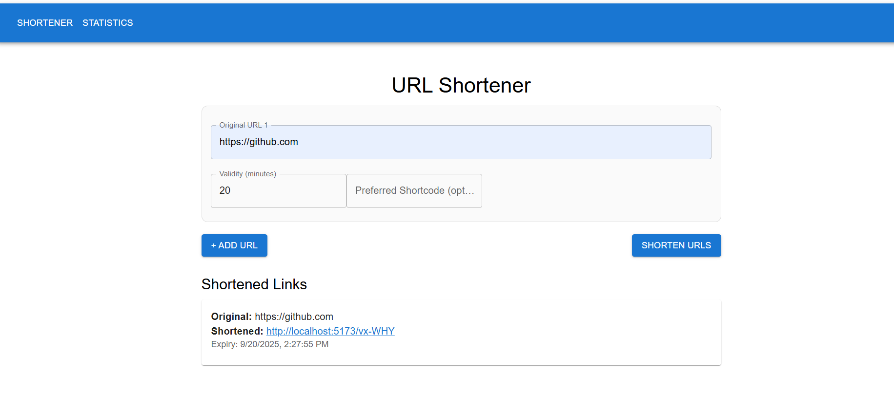
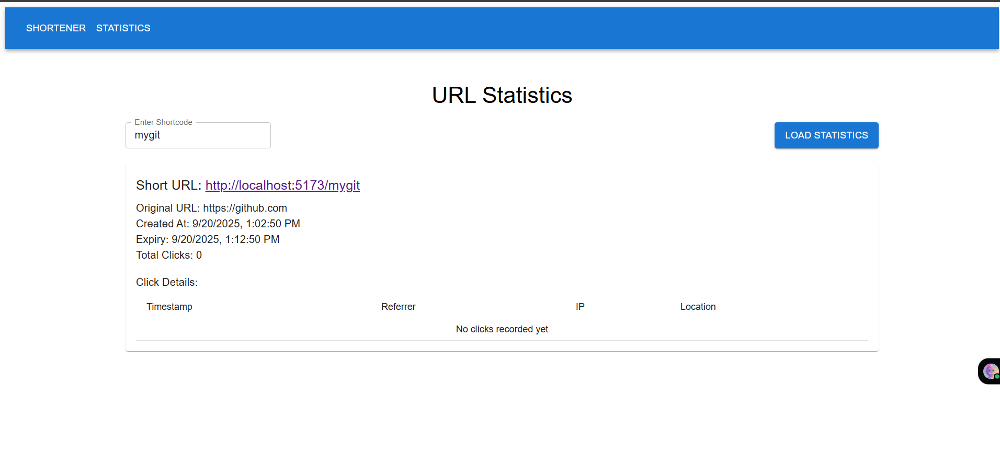
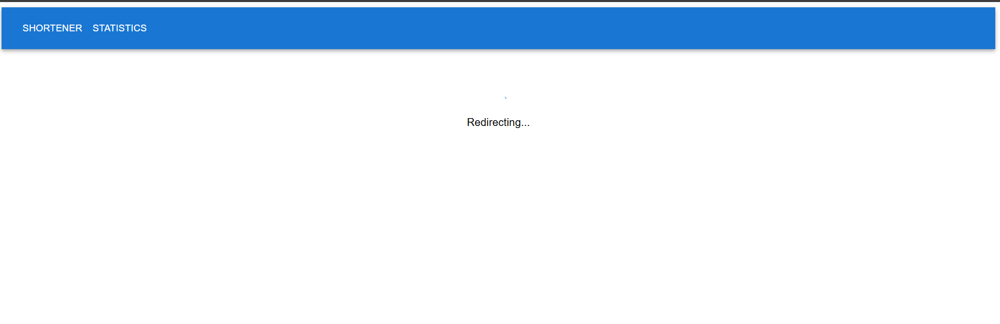
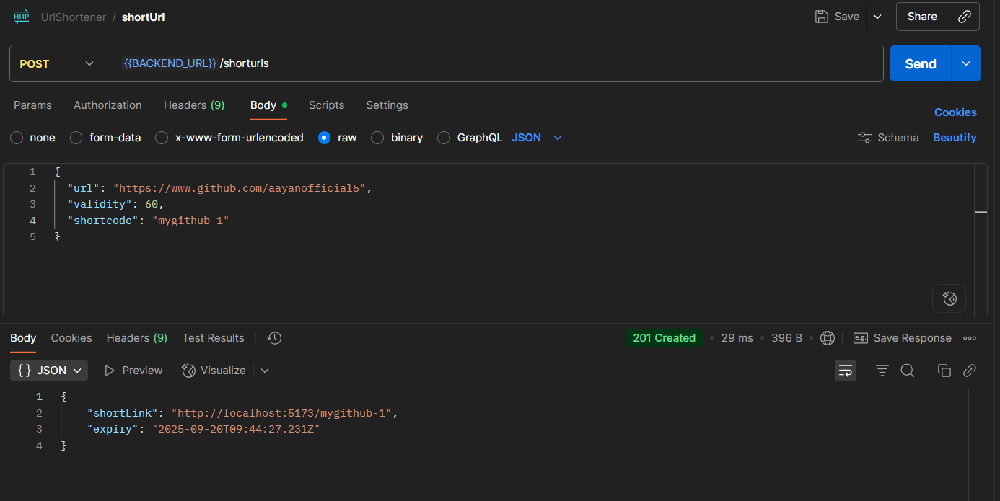
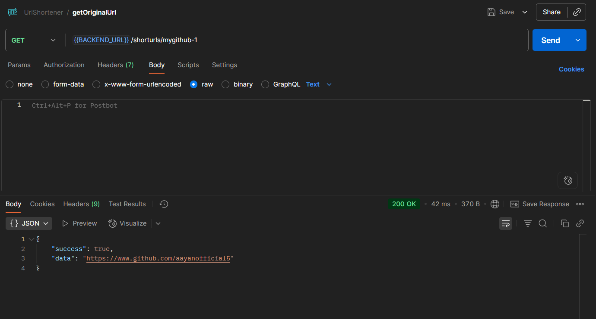

# 🔗 URL Shortener

A fullstack URL shortener application that converts long URLs into short, shareable links.  
Built with **Node.js, Express.js, MongoDB, React**.

---

## 🚀 Features
- Shorten long URLs into custom short links.
- Redirect short URLs to original URLs.
- Track number of clicks.
- REST API for URL shortening.
- Responsive frontend interface.

---

## 🛠️ Tech Stack
**Frontend:** React, HTML, CSS, Tailwind  
**Backend:** Node.js, Express.js  
**Database:** MongoDB  
**Other Tools:** Postman, Git, GitHub  

---

## ⚙️ Installation & Setup

### 1. Clone the repo
```bash
git clone https://github.com/aayanofficial5/220102616.git
cd 220102616
```

### 2. Backend Setup
```bash
cd server
npm install
npm run dev
```

### 3. Frontend Setup
```bash
cd client
npm install
npm run dev
```

### 4. Environment Variables
Create a `.env` file in `server/` with the following:
```
CLIENT_PORT = <your_react_app_port>  #eg.5173 
DATABASE_URL = <your_mongoDb_database_string>
```

Create a `.env` file in `client/` with the following:
```
VITE_API_URL = <your_backend_api> #eg.http://localhost:4000 
VITE_CLIENT_URL = <your_client_url> #eg.http://localhost:5173
```
---

## 📸 Screenshots

### Homepage


### Statistics Page


### Redirecting Page


---

## 📡 API Endpoints

### 1. Shorten URL
`POST /shorturls`
```json
{
  "url": "https://www.example.com",
  "validity": 10, // in minutes (eg.10)
  "shortcode": "mycode"
}
```

## Shorten URL API TESTING


### 2. Redirect
`GET /shorturls/:shortcode`

## Get Original URL API TESTING

---
